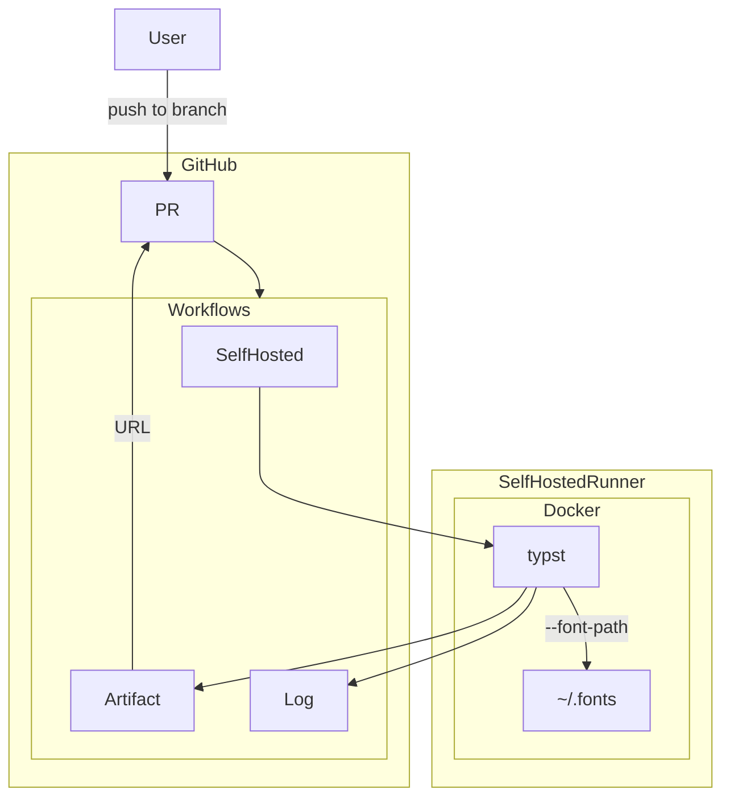

# 想定読者
- GitHubのworkflowを触れる程度の技術がある人
- GitHubを用いることで、一人または複数人での組版を楽にしたいと思っている人

# TL;DR
完成したテンプレートリポジトリはこちら
https://github.com/minerva-jupiter/typst-githubrun-template
使い方はREADMEをご覧ください。
# 経緯(長い駄文)
## 前史(TeX)
大学でのレポートをwordで書きたくないと思った私はTeXに魅了されていました。
WSLにTeX Liveをインストールし、TeXで大学のレポート等々をほそぼそと書いていました。
そんな2024年の12月、私の所属するサークルが冬コミに向けて部誌を発行することになりました。
自分の書いた記事が同人誌になるなんて夢のようでした。そのサークルは技術者コミュニティなので、記事はGitHubのプライベートリポジトリで管理され、提出形式はHTMLでした。
ですが、締切が近いことや、GitHubに慣れていないメンバーもいたせいか、CSSの参照が破壊されてしまったりしました。またmainブランチへの強制プッシュなども行われて、非常に混乱してしまいました。
また、完成した冊子を見ると、自分の記事もレイアウトが崩れてしまっていて、非常に悔しい思いをしました。そこで、完成のプレビューのPDFを吐くタイプの自動レンダリング組版システムを構築する決心をしました。
そして、完成したのがTeXをPDFにコンパイルしてArtifactに投稿するシステムでした。
## TeXってさ......
しかしながら、TeXの酷いエラーやTeX Liveの重さがネックとなり始めました。
極めつけは本格的に大学の実験レポートが始まったことでした。2週間に1回か2回PDFにして14ページ程度もあるレポートにぎっしりの文字と数式と図表を書く必要が発生したのです。それはTeXの長い記法にうんざりするには十分でした。
ニュートンの運動方程式を書くために、
```LaTeX
$ m \frac{d^2 x}{d t^2} = F $
```
って書くなんて冗長じゃないですか！
あわよくば、暗算しながら書けるくらいの使いやすさで書きたい！
そう思っていたときに私はTypstに出会いました。
typstで書くとこれですみます。
```typst
$ m (d^2 x)/(d t^2) = F $
```

## Typstの紹介
> Typst is a new markup-based typesetting system that is designed to be as powerful as LaTeX while being much easier to learn and use.

レポジトリのREADME.mdより
らしいです。意訳すると、「Typstは新しいマークアップを基とした、LaTeXみたく強力なそしてもっと学びやすくて使いやすいタイプセッティングのシステムです」です。(あんまり正確な翻訳じゃないかも)
そして何より、これはRust製です。そこが素晴らしい(Rust大好き人間なので)
正直なところ、まだ未発達な部分も多いので、枯れるまで開発されて、やっと使われるようになるかのスタートラインだとは思うのですが、それでも、こういう新しい技術は使ってみたくなります。
繰り返す文章をfor文で書けたり、数式を美しく簡単に書けたりと、そそる機能が満載です。
二点、問題点を挙げると、
1. テンプレート等が未発展
2. 日本語が使いにくい
です。テンプレートは自分なりに形成していけばよいのですが、警告メッセージにすべての日本語文字を出すのはやめてほしいですね。あとは、フォントの指定なのですが、規定の欧文フォントだと日本語を使えないので、かなり必須なところが設定が面倒です。typst.appでは日本語フォントの指定は`Noto Sans CJK JP`とできます。しかし、ローカルでのコンパイルとなると、話が変わります。私はtypstのシステムにフォントを追加する方法がわからなかったので、typstにコンパイルをお願いするときにttfファイルの在処を`--font-path ~/.fonts`で指定してコンパイルしています。ただ、毎回面倒だし、bash-completionで入力できないのでbashスクリプトを書いています。
ということで、まだまだ発展途上ですが、私は使いたい(というかTeXにうんざりしている)ので、Typstで組版システムを構築しようというのが今回の流れです。

# 設計

まず、はじめにこのシステムの設計思想です。
目的として

- Typstの実行環境が手元にない場合でも使いやすいこと
- 一つの絶対的なコンパイル手法を存在させること
- Typstの利点を活かせること

を設定しました。
したがって要件定義は

- GitHubのPRにpushするとすぐにプレビューができる形であること
- レンダリング手段が統一されていること
- typstをネイティブに叩いて変換を行うこと

となりました。
## システムの設計
上記より、今回は前回のシステムを踏襲するような形で書きたいと思います。
また、一部技術的な問題で達成できない目的があります。

これを基に構築をすすめていきます。
ですが、コンパイル速度の問題と、SelfHostedの部分が私のサーバのリソースと向き合った結果、足りない可能性が出てきたので、TypstをDockerの中ではなくて、SelfHostedサーバのネイティブ上にインストールかとおもっています。(なおSelfHostedサーバ自体がVMなので安全性は確保される)
# SelfHostedサーバの準備
一家に一台はあるであろう、自宅サーバに適当なVMを立てて、セットアップします。
UbuntuServerを使いました。そこにDockerとTypstをインストールして、あとはGitHubのActions/RunnerからSelfHostedRunnerを追加するボタンを押せば手順やトークンが出てくるのでそれに従えば良いです。

## typstのインストール
UbuntuServer上では
```
sudo snap install typst
```
で終わります。Rustをインストールしてビルドしたいけど、環境を統一したいので、これ一択ですね。

# Workflow
SelfHostedでtypstを実行するものを作成します。
なお、リリースビルドはSelfHostedだと怖いので、GitHubがホストしているRunnerにFontを入れて、Dockerでtypstのイメージを引っ張ってくる形にして安定を取りたいと思います。
完成品のworkflowはリポジトリに置いてあるので、そちらを見て貰えば良いです。
基本的には先人が作ったactionsの組み合わせで十分です。
というか、前回までの積み上げがあるとはいえ、workflowがバグ無しで完璧に動作したのめちゃくちゃ気持ち良い。

# fonts
これがかなりの鬼門でした。Log上では動作しているので、わからないのですが、出力されたPDFを見ると、文字化けしてしまって□ばかりが並んでいるものになっていました。
結論から言うとダウンロードしてサーバに入れていたフォントが悪かったのですが、ちゃんと動作するフォントと動作しないフォントがあって、大変でした。
私はNoto Sans JPを愛用しているのですが、Google fontsからのダウンロードをworkflowができない点が問題でした。そして、埋め込み用のotfファイルをダウンロードしてもtypstが読み込めなかったです。
NotoSansCJKのリポジトリから様々にotfファイルやttfファイルをダウンロードして入れてみましたが、細っそいフォントで描画されるのが関の山でした。しかし、LaTeXからTypstに移行した先人でNoto Sans CJK JPをインストールした方のQiitaを発見し、そのリンクのおかげで使えるようになりました。ここがこの記事で一番時間がかかりました。
[ありがたき先人のQiita](https://qiita.com/ryoshin0830/items/216f95790e21888ea5e7)

# あとがき
みんな、typst使ってくれるかな、いや、使われないだろう。ということで、部誌で採用されるわけもないのにtypstの組版システムを作成しました。このへんはバックエンドの表層を撫でてる感じがして、雲の上をスキップしている気分です。今度は平和に部誌を書ききりたいなと思いながら、今回はこのへんで〜。