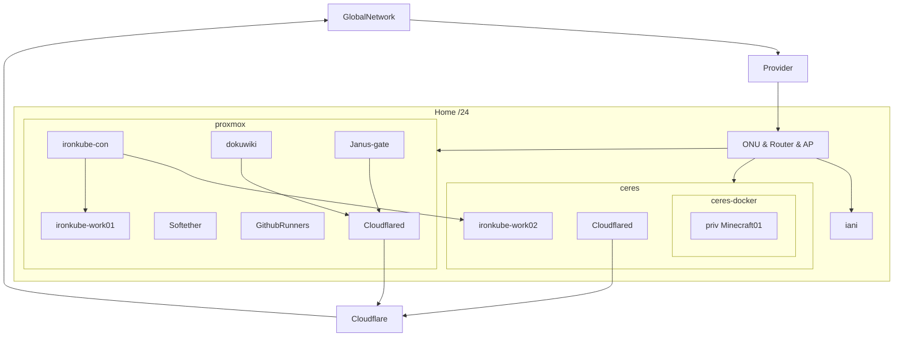

# 我が家のインフラまとめ
## Network

※Ceres is internal server name.
※ironkube is internal k8s cluster name.
## Spec
### Proxmox
|||
|-|-|
|CPU|Intel Core i3-4170|
|Mem|DDR3 8GB|
|SSD|128GB|
|HDD1|512GB|
|HDD2|512GB|
### Ceres
|||
|-|-|
|CPU|AMD Ryzen 3 PRO 2200G|
|Mem|DDR4 16GB|
|SSD|1TB|
## OS
### Proxmox's VM
|||
|-|-|
|cloudflared|UbuntuServer|
|dokuwiki|AlpineLinux|
|moodle|AlpineLinux|
|softether|UbuntuServer|
|github runner|UbuntuServer|
|janus-gate|GentooLinux|
### Ceres
UbuntuServer
